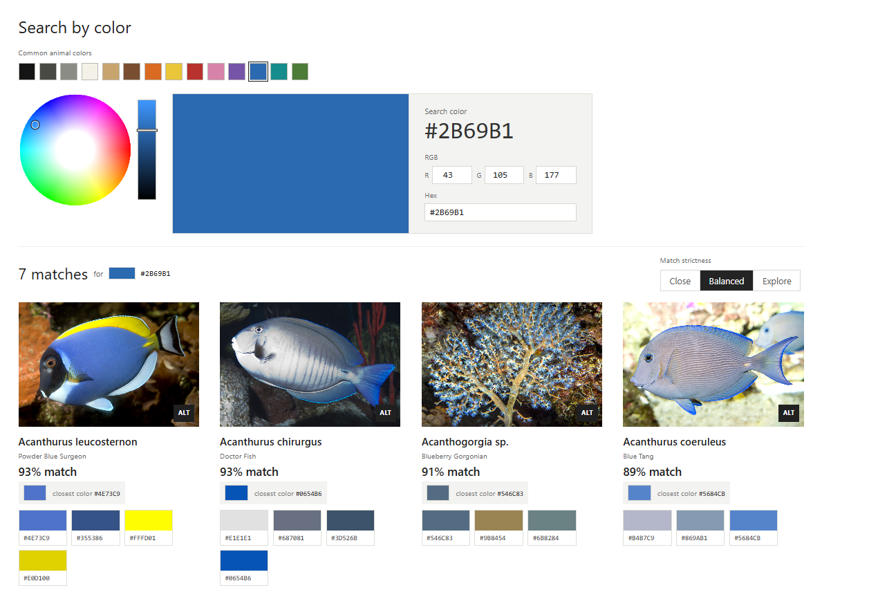
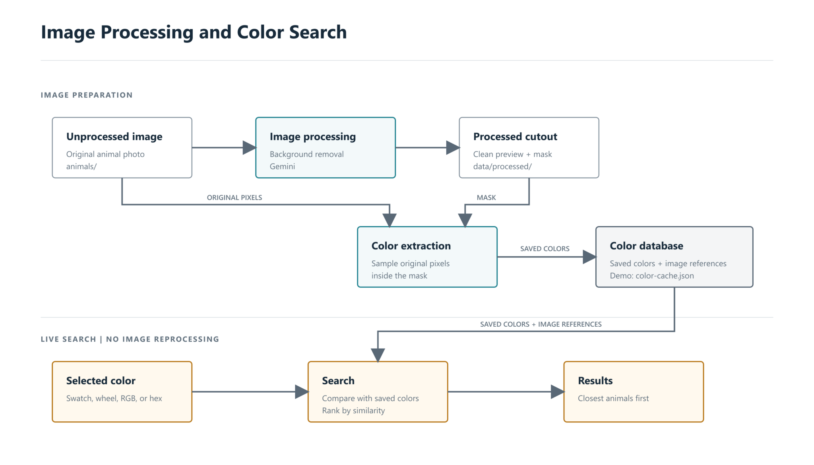

# Animal Color Search Demo

Local demo for searching aquarium animal images by color.

The handoff is sized for approximately 1,200 images. The files checked into this public repository are a smaller processed demo subset.



The included demo images have already been processed and reviewed, so reviewers can run the current demo without reprocessing images or using an API key.

## Run

```bash
npm install
npm start
```

Open:

```txt
http://127.0.0.1:3000
```

## Processing New Images

Gemini is only needed if you want to process new uploaded images or regenerate cutouts.

Create a `.env` file:

```txt
GEMINI_API_KEY=your_key_here
```

Do not commit `.env`.

The Process panel has two submission modes:

- `Standard · immediate` processes images now and is best for a single image or a live review.
- `Batch · lower cost` submits asynchronous Gemini Batch jobs and is intended for a large library run such as the approximately 1,200-image handoff. Batch results can take up to 24 hours. The server keeps polling while it is running, imports completed cutouts into the existing mask/color pipeline, and records per-image failures for review.

Batch job metadata is stored locally in the ignored `data/batch-jobs.json` file. The default provider group size is 100 requests and can be changed with `GEMINI_BATCH_GROUP_SIZE`. Input JSONL is streamed to disk and automatically split before the configured file-size ceiling (`GEMINI_BATCH_MAX_FILE_MB`, 1,800 MB by default).

### Receiving Batch Results

Gemini does not email the finished images. When a batch completes, the running server downloads Gemini's results file automatically, saves each generated subject mask in `data/masks/`, runs the existing color extraction, and updates `data/color-cache.json`. The Process panel tracks every active local batch and reports how many images are ready or failed. If the server was stopped while Gemini worked, restart it and the saved batch-job metadata will let it resume checking and importing results.

Provider display names are deterministic, so restart recovery can reconnect a local group to a job that Gemini already accepted. The server records that a create call is about to be attempted and, if its outcome is uncertain, only retries reconciliation rather than risking a second charged submission. Temporary polling or download failures use bounded retries; a terminal failure marks every unfinished image as failed so it can be selected again. Animals assigned to an active batch are excluded from immediate processing to prevent cross-mode duplicate work.

## What's Included

- `animals/` - original demo images
- `data/masks/` - readable `OriginalName-mask.png` subject masks used for color analysis
- `data/color-cache.json` - saved image/color metadata
- `batch-processing.js` - Gemini Batch request, result, retry, and summary helpers
- `Shedd_Go_AltText_Demo_Sample.xlsx` - sanitized fallback metadata for the included demo images
- `public/` - frontend HTML, CSS, and JavaScript
- `server.js` - local Express server, image processing, and search API
- `docs/` - design notes and code review guide

## Image Processing and Color Search

New animal images are processed once to create a clean cutout and subject mask. Color extraction samples the original pixels inside that mask, then saves the colors with their image references. Live searches compare the selected color with that saved data, so searching does not reprocess images or make a Gemini request.



[Editable SVG version](docs/images/gemini-model-flow.svg)

### How Originals and Masks Are Linked

`data/color-cache.json` is the manifest connecting each original image to its internal subject mask and searchable colors. A record begins like this:

```json
"35e43936501612d6": {
  "sourceRelPath": "Abudefdufsaxatilis_Sergeantmajor.png",
  "maskRelPath": "data/masks/Abudefdufsaxatilis_Sergeantmajor-mask.png",
  "sourceHash": "9346a6b9..."
}
```

- The 16-character object key is a stable internal ID derived from `sourceRelPath`. It is used by the API and UI; it is not an image filename.
- `sourceRelPath` locates the displayed original inside `animals/`.
- `maskRelPath` locates the readable internal mask used for color analysis.
- `sourceHash` is a SHA-256 fingerprint of the original file contents. If the original changes without being renamed, the hash changes and the existing mask/colors are treated as stale.

Renaming or moving an original changes its stable ID because its relative path changed. Editing the contents changes `sourceHash` but not the ID.

## Review Notes

This is a local MVP/demo, not production infrastructure.

The full working metadata covers approximately 1,200 images. The included XLSX is a small sanitized fallback sample containing only the checked-in demo images. CSV is the preferred format for handoff and integration; XLSX remains supported so the demo runs with its existing reviewed alt text.

## CSV Alt Text Metadata

CSV is the preferred format for managed alt-text metadata. Place either of these files in the project root and restart the server:

- `Shedd_Go_AltText_Drafts.csv` for the full working metadata
- `Shedd_Go_AltText_Demo_Sample.csv` for demo metadata

The CSV must have a filename column so rows can be matched to images. The current spreadsheet headers work as-is, including `Original filename` and `Alt Text DRAFT`. Shorter headers such as `filename` and `alt_text` also work.

Minimal example:

```csv
filename,alt_text
Abudefdufsaxatilis_Sergeantmajor.png,"Silver fish with five bold black vertical stripes."
```

When matching files exist, full metadata takes priority over demo metadata and CSV takes priority over XLSX at the same level. CSV fields may contain commas, quotes, or line breaks when enclosed in double quotes.

Alt text is retained in the image metadata returned by the API and applied to HTML image `alt` attributes for accessibility. It is not rendered as visible copy in the search results.

The color search uses automated image analysis tuned for the included demo set. New uploaded images may need review after automatic processing.

For implementation details, see:

- `docs/code-review-guide.md`
- `docs/aquarium-demo-design.md`
- `docs/gemini-prompt-engineering.md`
- `docs/ai-agent-coding-workflow.md`

## Do Not Commit

- `.env`
- `node_modules/`
- logs
- temporary output files
- `data/batch-jobs.json`
- `Shedd_Go_AltText_Drafts.csv`
- `imageMetaData_Final.csv`
